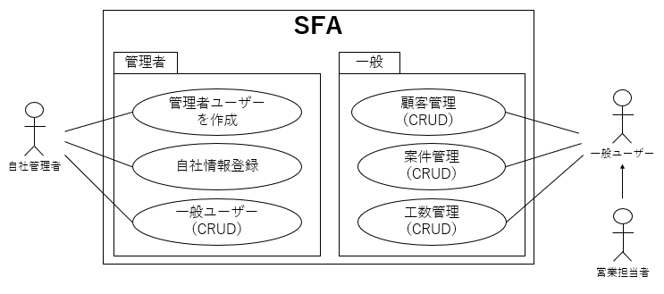
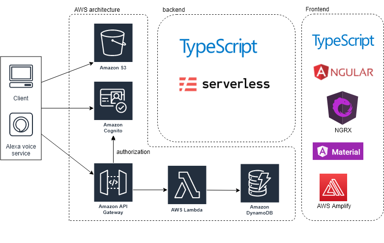
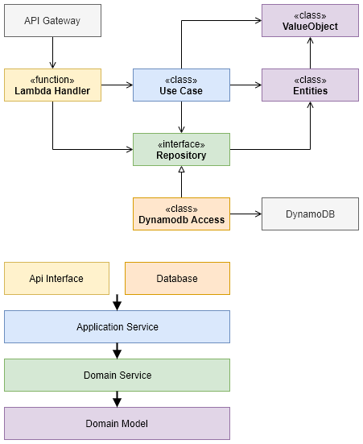

# SFA

## １．目的
本アプリケーションは「モダンアーキテクチャ」の学習を目的として開発している。

開発しているシステムはSFA（営業支援システム）の「顧客管理」「案件管理」「工数管理」とした。

モダンアーキテクチャの検証を目的としているため、アプリーケーションのドメイン分析はまったく行われていない。技術検証を目的として、プロトタイプの開発を行った。  


## ２．アプリケーションのイメージ

本アプリケーションは、自社の管理を行う「管理者用AP」と、一般ユーザーが行う「一般ユーザー用AP」に分かれる。  
※Cognitoのユーザープールについても各APで分かれている。 



## ３．アプリケーションのアーキテクチャ



## ４．サーバーサイドのアーキテクチャ



## ５．クライアントサイドアーキテクチャ

各アプリーケーションはLazyLoadingを行い、データフローはNGRXに則っている。  
フォルダ構造は下記の通り。  

```
FrontEnd/
    　└ src/
          └ app/
            ├ auth
            ├ components
            ├ pages　＜各アプリーケーションのプログラム＞
                ├ apps-admin ＜管理者用AP＞
                          ├ case ＜案件管理＞
                              ├ store　＜案件管理用のStore＞
                          ├ customer ＜顧客管理＞
                          ├ home ＜ホーム画面＞
                          ├ manhour ＜工数管理＞
                          ├ routes.ts ＜LazyLoading定義＞
                ├ apps-common/change-password ＜共通AP＞
                ├ apps ＜一般ユーザー用AP＞
                ├ base 
                ├ login
            ├ store　＜Root Store＞
            ├ utils
```


## ６．開発環境

### ６－１．[BackEnd開発環境](./BackEnd/README.md)
### ６－２．[FrontEnd開発環境](./FrontEnd/README.md)
